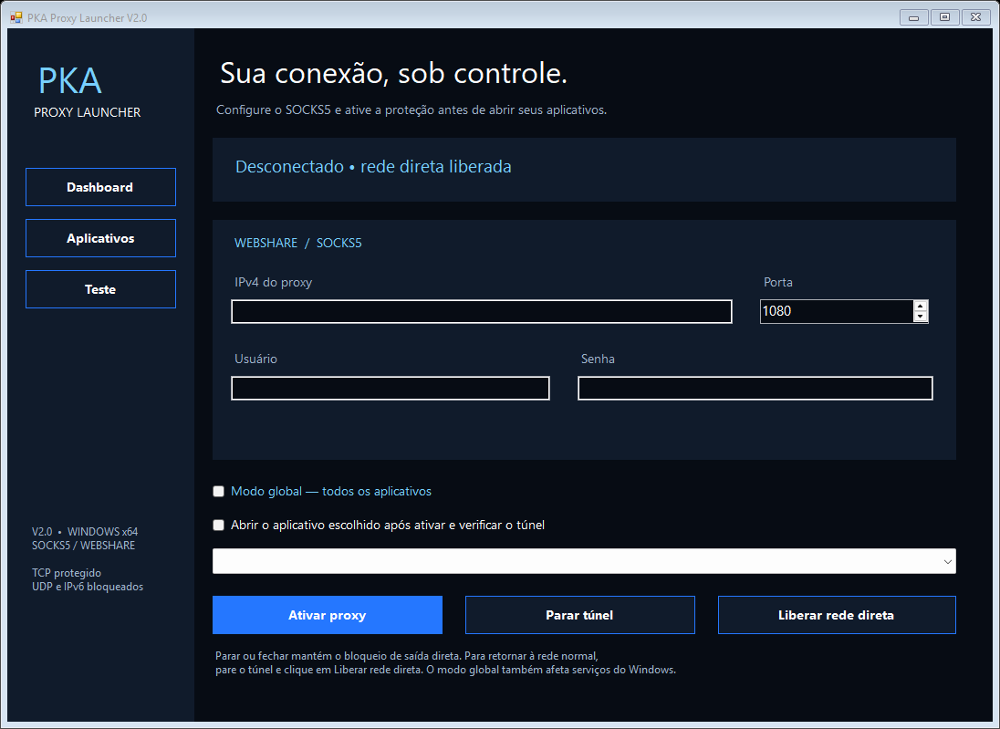

# PKA Proxy Launcher V2.0

A V2 está em [launcher-v2](launcher-v2/LEIA-ME.md): interface em preto, azul e azul-claro, Dashboard, Aplicativos, Teste, seleção por caminho do executável, SOCKS5 real, abertura automática e filtros persistentes WFP para bloquear saída fora do túnel.

**Candidato para validação:** compilação e 54 verificações automatizadas passaram; configurações global e por aplicativo foram aceitas pelo sing-box real. A ativação administrativa do WFP, roteamento no Windows e testes de queda do motor/Webshare precisam de validação em VM. Consulte [a lista de testes pendentes](launcher-v2/VALIDACAO-VM.md). Não é uma release aprovada nem uma promessa de ausência de vazamentos.

TCP/IPv4 é encaminhado; UDP/IPv6 de alvos protegidos são bloqueados. O modo por aplicativo não inclui automaticamente processos auxiliares ou serviços compartilhados. O motor e a interface são exceções explícitas. Parar ou fechar mantém o bloqueio persistente; use Liberar rede direta ou Recuperar-rede.cmd para recuperação.

```powershell
cd launcher-v2
.\build.ps1
.\test.ps1
```

O build usa .NET Framework e o motor sing-box 1.14.2 fixado no pacote. As credenciais não devem ser adicionadas ao repositório. Perfil e pedidos usam DPAPI; a configuração ativa do motor fica em diretório administrativo protegido.



A implementação anterior permanece nos arquivos da raiz, com documentação em [README-1.3.md](README-1.3.md). Para a V2, use os scripts da pasta launcher-v2; os scripts antigos da raiz não geram esta versão. Nenhuma release anterior é substituída automaticamente.
